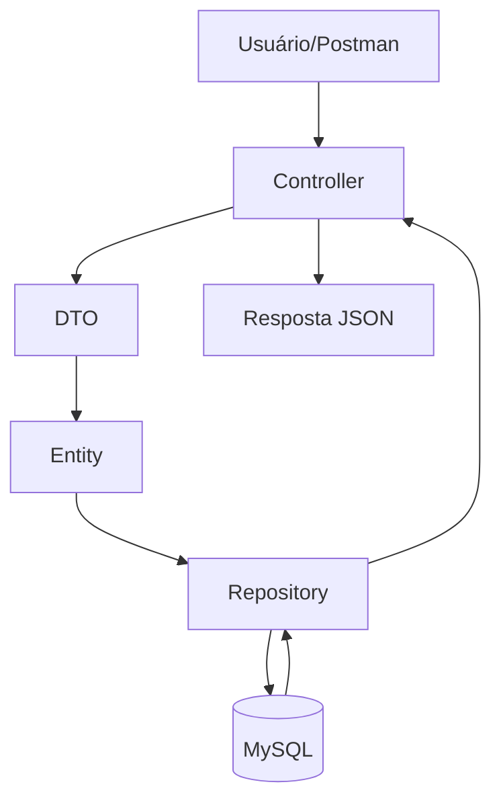

Glauco Heitor - RM 555978

Victor Freire - RM 556191

Enrico Ricarte - RM 558571

Pedro Gaspar - RM 554887

Pedro Henrique - RM 556278

# 🌎 Space Monitor System

## 📌 Sobre o Projeto

O **Space Monitor System** é uma aplicação desenvolvida em Java com Spring Boot voltada para o monitoramento de queimadas e sensores ambientais.

O projeto foi criado com foco no desafio:

> “Propor soluções que usem tecnologia, dados e inovação para resolver desafios da Terra, ampliar as possibilidades da economia espacial e criar oportunidades para o futuro.”

A aplicação simula um sistema inteligente capaz de registrar alertas de queimadas e monitorar sensores distribuídos em diferentes regiões, auxiliando no acompanhamento de riscos ambientais e coleta de dados.

---

# 🚀 Tecnologias Utilizadas

* Java 25
* Spring Boot
* Spring Data JPA
* Hibernate
* Flyway
* MySQL
* Maven
* Lombok
* Postman

---

# 📂 Estrutura do Projeto

```bash
src
 ├── controller
 ├── domain
 │    ├── alerta
 │    ├── sensor
 │    └── endereco
 ├── repository
 └── resources
      └── db.migration
```

---

# 🛰️ Funcionalidades

## 🔥 Alertas

* Cadastro de alertas ambientais
* Atualização de alertas
* Listagem paginada
* Exclusão lógica
* Registro de:

  * Região
  * Intensidade
  * Tipo de queimada
  * Data de detecção
  * Nível de risco

---

## 📡 Sensores

* Cadastro de sensores ambientais
* Atualização de sensores
* Listagem paginada
* Exclusão lógica
* Registro de:

  * Nome do sensor
  * Localização
  * Status
  * Tipo do sensor

---

# 🗄️ Banco de Dados

O projeto utiliza:

* MySQL
* Flyway Migration

Exemplo de migrations:

* Criação de tabelas
* Alter Table
* Adição de colunas

---

# 🔗 Endpoints da API

## 📡 Sensores

### POST

```http
POST /sensores
```

### GET

```http
GET /sensores
```

### PUT

```http
PUT /sensores
```

### DELETE

```http
DELETE /sensores/{id}
```

---

## 🔥 Alertas

### POST

```http
POST /alertas
```

### GET

```http
GET /alertas
```

### PUT

```http
PUT /alertas
```

### DELETE

```http
DELETE /alertas/{id}
```

---

# 🔄 Diagrama de Fluxo



---

# 🧠 Conceitos Aplicados

* Programação Orientada a Objetos
* DTOs
* Encapsulamento
* Injeção de Dependência
* API REST
* Persistência com JPA
* Versionamento de banco com Flyway
* Exclusão lógica
* Validação de dados
* Organização em camadas

---

# ▶️ Como Executar

## 1️⃣ Clonar o projeto

```bash
git clone URL_DO_REPOSITORIO
```

---

## 2️⃣ Configurar o banco MySQL

Criar o banco:

```sql
CREATE DATABASE space_monitor_system;
```

---

## 3️⃣ Configurar o application.properties

```properties
spring.datasource.url=jdbc:mysql://localhost:3306/space_monitor_system
spring.datasource.username=root
spring.datasource.password=sua_senha
```

---

## 4️⃣ Executar o projeto

Rodar a aplicação pelo IntelliJ ou:

```bash
mvn spring-boot:run
```

---

# 📸 Evidências de Execução


---

# 📌 Considerações Finais

O projeto demonstra a utilização de tecnologias modernas para monitoramento ambiental, utilizando conceitos de engenharia de software, APIs REST e banco de dados para criar uma solução organizada, escalável e alinhada ao desafio proposto.
